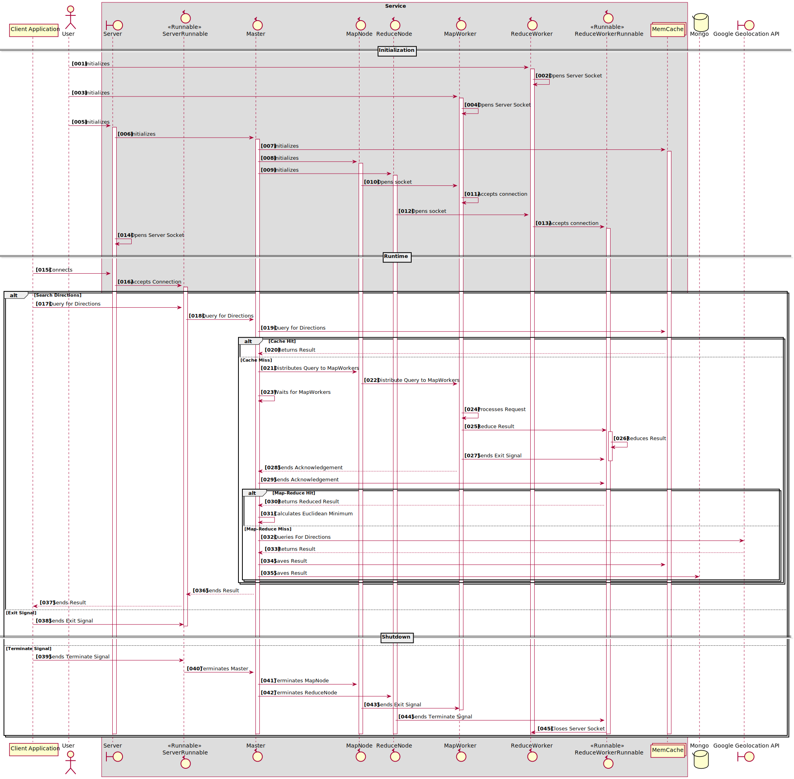

# Directions Map Reduce Server # 
[](https://travis-ci.com/steve-papadogiannis/dist-sys-server-java)

A small project that takes directions queries and produces directions results in polynomial representation.

## Versions ##

* JDK: 1.8.0_251
* Maven: 3.6.3
* Mongo: 4.4.4
* google-maps-services SDK: 0.1.20 (modified)

## Sequence Diagram ##



## Build ##

Clean:

```
 mvn clean -Dapi.key=api.key -Dtest.api.key=test.api.key -B -V
```

Install:

```
mvn install -Dapi.key=api.key -Dtest.api.key=test.api.key -DskipTests=true -Dmaven.javadoc.skip=true -B -V
```

## Run ##


